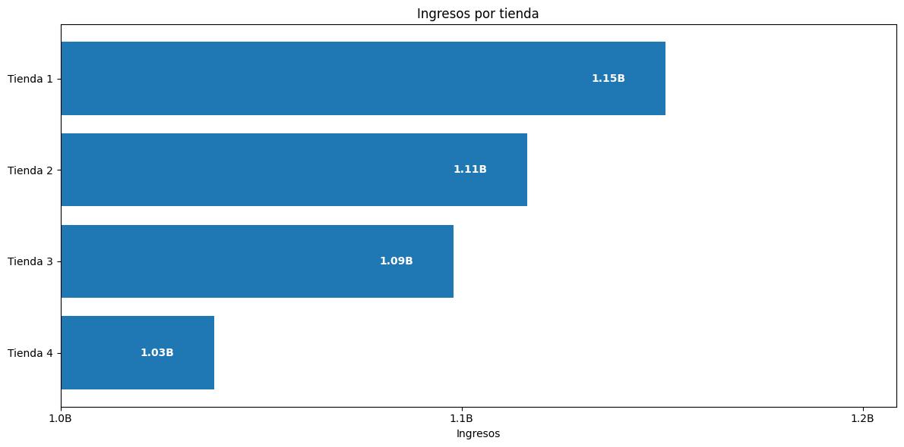
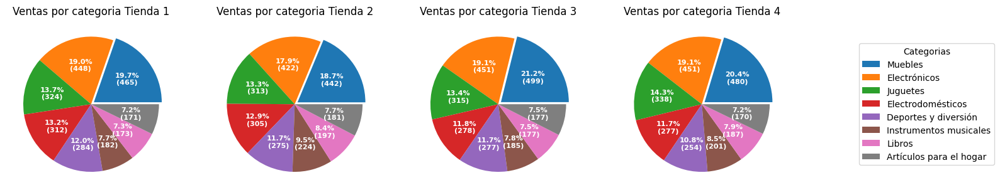
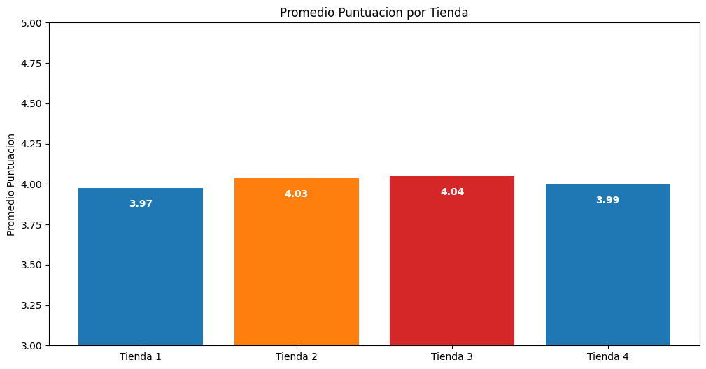
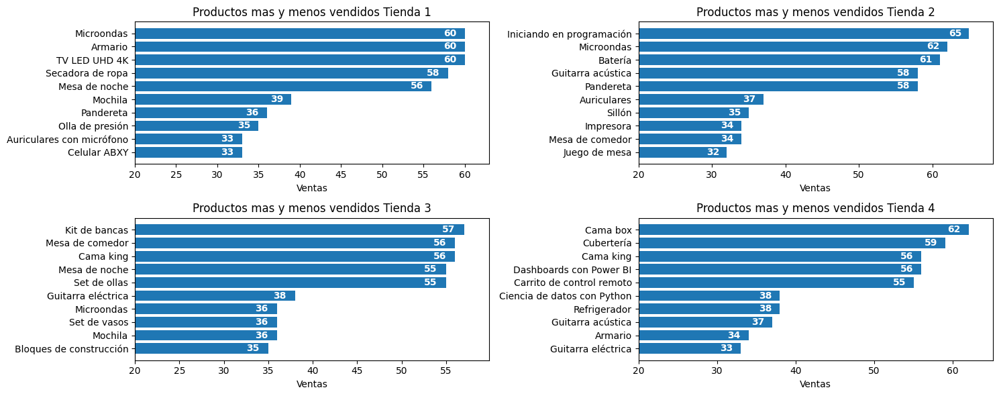

# Challenge Alura Store

# Objetivo

Durante este desafío, mi rol es ayudar al Sr. Juan a decidir qué tienda de su cadena Alura Store debe vender para iniciar un nuevo emprendimiento. Para ello, debo analizar datos de ventas, rendimiento y reseñas de las 4 tiendas de Alura Store. El objetivo es identificar la tienda menos eficiente y presentar una recomendación final basada en los datos.

# Tareas

- Cargar y manipular datos CSV con la biblioteca Pandas.

- Crear visualizaciones de datos con la biblioteca Matplotlib.

- Analizar métricas como ingresos, reseñas y rendimiento de ventas.

# Tecnologias

- Python
- Pandas
- Pyplot
- numpy

# Estructura del projecto

- /codigo_python/ : codigo de respaldo en archivos .py
- /images/ : fotos de los graficos mostrados aqui
- AluraStoreLatam_Josue_Marquez.ipynb : archivo notebook google colab
- Readme.md : el archivo que estas leyendo ahora

# Como ejecutar

- Google Colab
    1. Descargar archivo notebook `AluraStoreLatam_Josue_Marquez.ipynb`
    2. Importar a Google Colab
    3. Hacer click en 'Ejecutar todo'

# Ejemplos de graficos

Como parte del analisis se crearon varios graficos como:

1. Ingresos totales por tienda
   

2. Grafico de torta de las categorias mas vendidas por tienda
   

3. Puntuacion promedio por tienda
   

4. Productos mas y menos vendidos por tienda
   

# Conclusion

Basado en los graficos y otros analises realizados la unica metrica que destaca y que podria ser utilizada para tomar una decision es las ventas totales.

Por lo cual mi recomendacion es vender la **Tienda 4** la cual tiene las menores ventas de las 4 tiendas.
